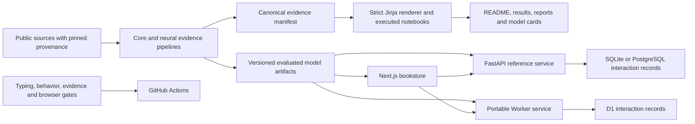

# Architecture

Stacks combines a reproducible offline measurement pipeline, a Next.js review application and two implementations of a durable recommendation service. These are demonstration recommendations on a public dataset; no real reader's identity is present and no recommendation is personalized to a real person.

## Measurement boundary

The pipeline reads the complete Goodbooks ratings file and ten-thousand-book catalog. Reader-level comparisons sample explicitly eligible populations. The canonical manifest records those counts, protocols, model results and estimator evidence. Generated documents are complete files: CI rejects missing, empty, stale or modified reports rather than scanning only selected numeric claims.

Goodbooks provides row order without event timestamps. A source-order holdout cannot establish a dated historical backtest. The learned ranker uses an earlier label partition; undated snapshot text is identified separately. See [the protocol](docs/evaluation.md) for model features, exclusions, uncertainty, cohorts and comparison families.

Exact full-catalog scoring makes candidate errors inspectable. A local pgvector experiment additionally measures approximate recall against exact SQL with matching exclusions. Its latency and retrieval result concern its frozen embeddings and query sample, not the public serving workload.

## Serving boundary

The browser can explore static artifacts offline. Durable mode calls a service that persists an exposure before acknowledging it. The FastAPI reference uses SQLAlchemy with SQLite or PostgreSQL. The portable Worker uses the same exported model evidence and a D1 binding. Neither may replace the evaluated scorer with an unrelated convenience formula. Artifact hashes and cross-runtime ranking fixtures make that contract testable.

GitHub Pages hosts the frontend. The [public Sites API](https://stacks-recommender-api.mekalaa1.chatgpt.site/health) uses a Worker and D1 to satisfy the strict free-hosting requirement. Public request, feedback, resume and bounded-SSE checks passed, followed by an independent D1 connector read of the selected click record. [Deployment evidence](results/deployment-verification.json) records the checks and matching write. Browser bundles contain no database connection string or administrative credential.

The managed proxy buffers long streaming responses. The Worker consequently closes SSE responses after a two-second window, and EventSource reconnects after one second using Last-Event-ID. Persisted events support replay and changed-revision delivery across connections. This is bounded SSE reconnection, not continuous chunk delivery on one long-lived response.

The portable Sites source package contains only serving code, schema and frozen inputs plus the source GitHub revision. This avoids the provider's source-upload size limit. The full research repository remains on GitHub. [The runbook](docs/runbook.md) describes packaging and verification. PostgreSQL remains an optional local/reference backend and the local ANN benchmark database; the deployed service uses D1.

Exposure probabilities describe the actual action unit and logging policy. Full slates and supported exploratory actions are distinguished. Feedback is joined to exposures, and observation windows distinguish pending outcomes from negatives. Resume tokens reconnect to durable session state. See [logging](docs/logging.md) for probability, horizon and replay semantics.

## Selection boundary

The model comparison includes baseline, text, learned tree, neural and recent-history approaches. The measured result, including weak learned models, remains in the report. A larger model is not presumed better.

The registry evaluates evidence eligibility separately from activation. Missing or invalid evidence fails eligibility. Local candidate audits and recorded API latency are operational measurements, not commercial uplift. A supported target, completed outcome horizon and running logger are prerequisites for live off-policy evidence. Offline superiority alone never changes a deployed policy.
