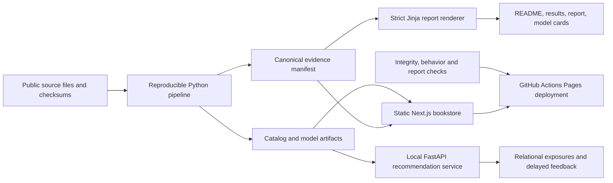

# Architecture

Stacks is a bookstore demonstration with an offline measurement pipeline, a
static review application, and an independently runnable recommendation API.
These are demonstration recommendations on a public dataset; no real reader's
identity is present and no recommendation is personalized to a real person.

## Measurement boundary

The canonical manifest records the backend, input provenance, evaluated catalog,
protocols, and measured model and estimator results. Generated reports are whole
files rendered from this manifest. CI regenerates each expected file in memory
and fails on missing, empty, extra, or changed generated reports. Hand-editing a
metric in Markdown therefore cannot make it through the claim gate.

Goodbooks exposes source row ordering but no event timestamps. The implemented
split uses that order as a proxy and evaluates a bounded catalog. This does not
establish a calendar-time backtest or a result on the entire source dataset.
See [the evaluation protocol](docs/evaluation.md) for exclusions, uncertainty,
candidate ranking, and diagnostic comparisons.

## Serving boundary

GitHub Pages serves static files. Browser exploration can use the committed
catalog and browser state, but a static page cannot commit an exposure to the
server database. Durable serving is a separate FastAPI process with its own
database. The application must identify which mode produced its results.
Public API hosting is unprovisioned; local API behavior is documented and tested
separately from the hosted website.

Exposure propensities describe the implemented logging policy and action unit.
They are not invented probabilities for a deterministic ranked slate. Impression
and feedback timestamps remain distinct. See [logging](docs/logging.md) and
[serving](docs/serving.md) for the request contract and persistence checks.

## Scope and replacement paths

Popularity, item cosine, alternating least squares, and a score blend form the
model comparison. A blend is not a learned LambdaMART ranker. Exact scoring of
the evaluated catalog makes candidate omissions inspectable; an approximate
pgvector index and recall-loss experiment are not delivered. Neural two-tower
training, external text-model weights, and a recurrent session model remain
future work.

The registry evaluates promotion eligibility separately from serving activation.
Missing or invalid evidence must fail eligibility. Offline evidence alone is
insufficient to claim a commercial uplift or automatically change a deployed
policy. A real experiment requires a running logging service, supported action
probabilities, and completed outcomes.
